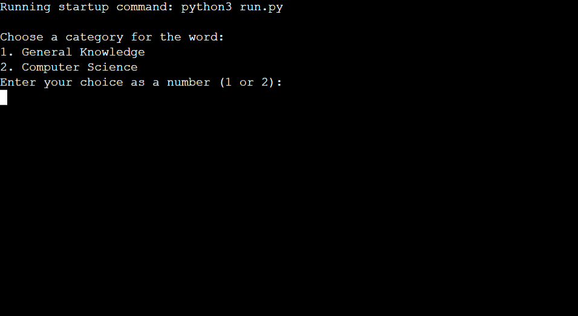
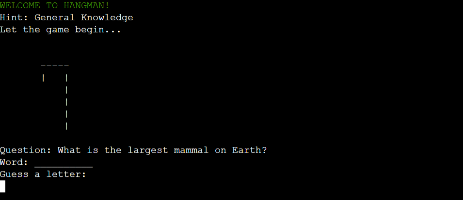
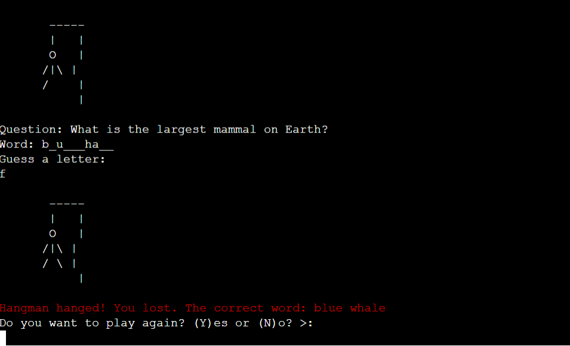
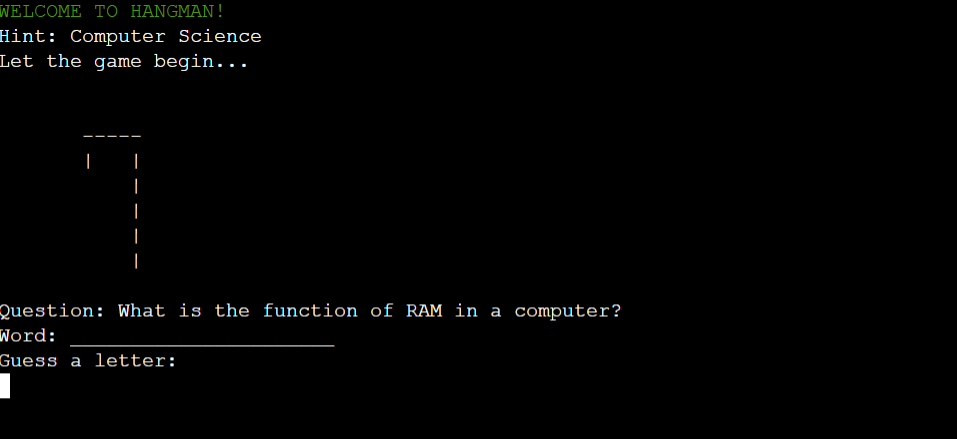
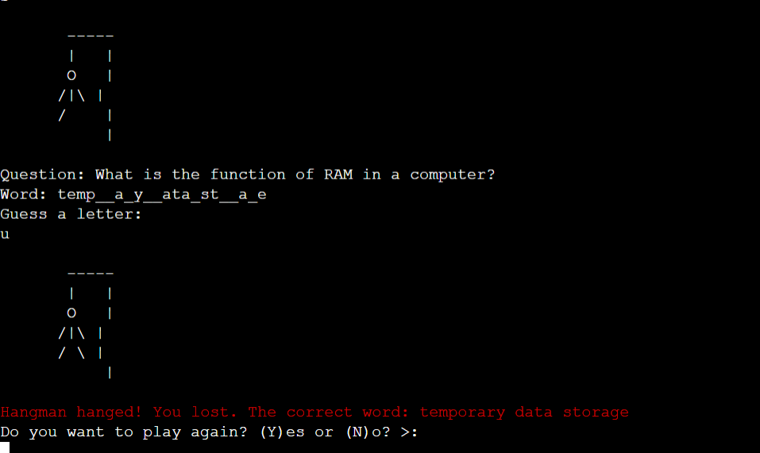
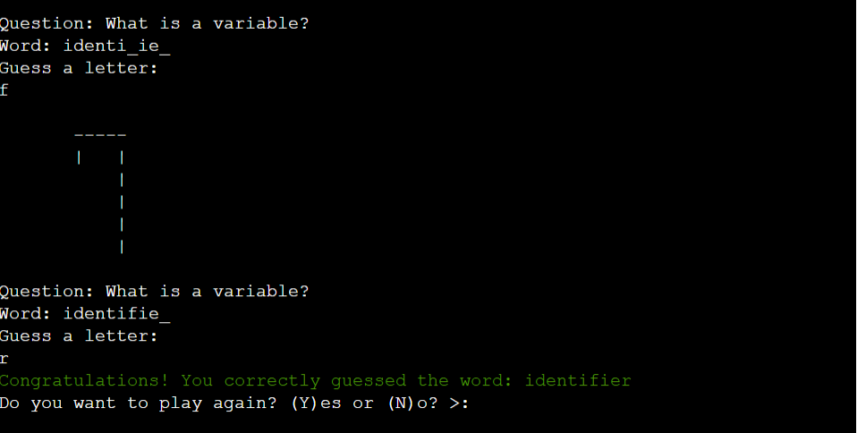

# [Hangman Game](https://hangman-game2-bebf4ae175e2.herokuapp.com/)
Welcome, Hangman Game

Hangman is a pencil and paper guessing game that can be played with two or more players. A player tries to guess a word, phrase or sentence by suggesting letters or numbers in turn. For each letter or number the player does not know, a piece of the gallows is drawn. If the player knows all the letters or numbers, they win the game; if they don't and the drawing of the gallows is completed, they lose.
___

___
## How to play
- Run the `Hangman_Game.py` file.
- Choose a category (General Knowledge or Computer Science).
- Guess the word or answer the question correctly to win.
- Enjoy the game!
___
## Random board generation
### General Knowledge 



___
### Computer Science




## Dependencies
- `colorama` library for colored console output. Install it using:

    ```bash
    pip install colorama
    ```
___
## Instructions
- The game supports two categories: General Knowledge and Computer Science.
- For each category, you can guess letters to reveal the hidden word or answer the question.
- Incorrect guesses lead to the drawing of the hangman, with a total of 6 incorrect attempts allowed.
___

## Features Left to Implement

- Add skip question button
___
## Validator Testing

### I tested this project manually by doing the following:

- I passed the code through a PEP8 linter and verified that there were no issues
- Tested on my local terminal and Code Institute Heroku terminal
___
## Deployment

This project was deployed using Code Institute's mock terminal for Heroku.

• Steps for deployment:

• Fork or clone this repository

• Create a new Heroku app

• Set the buildbacks to Python and NodeJS in that order

• Link the Heroku app to the repository

• Click on [Deploy](https://hangman-game2-bebf4ae175e2.herokuapp.com/)
___
Credits

• Code Institute for the deployment terminal

• Wikipedia for the details of the Hangman game